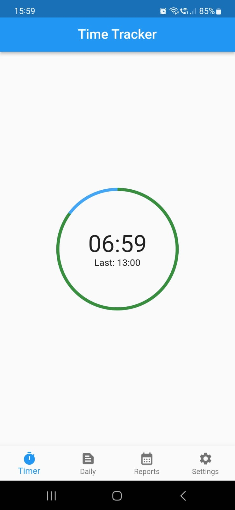
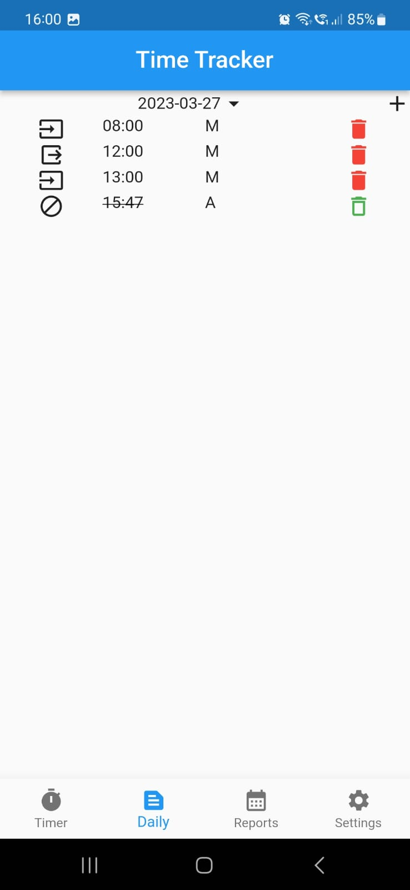

# Time Tracker

Time Tracker is a very basic application intended to help its user to track his/her working time by taping on a button
when he/she starts his/her activities and click again when he/she stops them.

This application is under development: All minimal features are not yet implemented, DB models may change from version
to version. It has only be tested on Android phones, yet. No support will be provided until it is explicitly mentioned.

